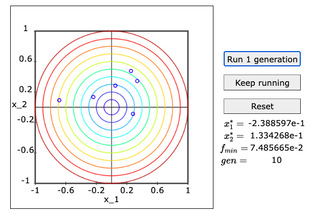
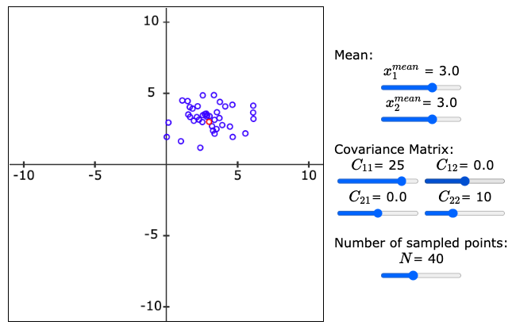

# [CMA-ES Interactive Demo](https://vivektramamoorthy.github.io/CMAEStutorial/)
This is a web demonstrator that provides a friendly introduction to the Covariance Matrix Adaptation-Evolution Strategy (CMA-ES).

## How do I use it?
Open the webpage [here!](https://vivektramamoorthy.github.io/CMAEStutorial/)
## What you can do with this?
- Test and visualise CMA-ES in action for a simple convex optimisation problem.

- Play with the covariance matrix coefficients in 2D and understand what the elements signify.+

## License
MIT License (c) 2021 Vivek T Ramamoorthy
